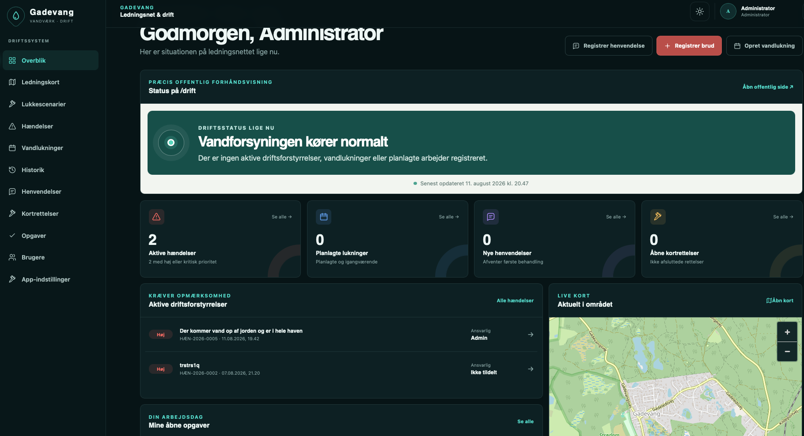

# GAVADR Drift

Selvhostet driftsapplikation til et lille lokalt vandværks ledningsnet. GAVADR gør det enkelt at holde styr på brud og planlægning af vandlukninger samt at koordinere den daglige drift.

Systemet giver samtidig en præcis forhåndsvisning af driftsinformationen til værkets hovedhjemmeside. Når planlagt arbejde publiceres, vises informationen automatisk på den offentlige driftsstatus, og den fjernes igen, når arbejdet er overstået eller vandlukningen aflyses.

## Driftsoverblik

Forsiden samler aktuelle hændelser, planlagte vandlukninger, offentlig driftsstatus og kortvisning, så vandværket hurtigt kan få overblik over den daglige drift.



Fase 1-7 omfatter login og roller, PostGIS-kort, hændelser, vandlukninger, historik til bestyrelsesopfølgning, henvendelser, kortrettelser, leverandører, opgaver, godkendt offentlig driftsstatus samt drifts-, backup- og sikkerhedsgrundlag.

## Start

Krav: Docker med Compose-plugin.

```bash
cp .env.example .env
# Erstat alle replace-with-værdier og gennemgå resten af .env
docker compose config --quiet
docker compose up --build -d
./scripts/create_admin.sh admin@example.dk "Administrator"
./scripts/release-check.sh
```

Applikationen er tilgængelig på `http://127.0.0.1:8080`. OpenAPI findes på `/docs` og `/openapi.json`. Den offentlige status findes dynamisk på `/api/public/driftsstatus`; `/public/driftsstatus.json` bliver tilgængelig efter første publicering.

## Udvikling

```bash
docker compose --env-file .env.dev -f docker-compose.yml -f docker-compose.dev.yml up --build
```

Frontend, backend og PostgreSQL bindes kun til localhost i udvikling. Tunnelprofilen startes ikke. `.env.dev` må aldrig anvendes i produktion. Backend-tests køres med `pytest` i `backend/` efter installation af `.[test]`.

## Drift

- Produktionsporten bindes som standard til localhost; PostgreSQL eksponeres ikke.
- Cloudflare Tunnel aktiveres eksplicit med `docker compose --profile tunnel up -d cloudflared`.
- Daglig backup aktiveres med `docker compose --profile backup up -d backup`.
- Manuel, atomisk backup køres med `./scripts/backup.sh`.
- Restore er destruktiv og dokumenteret i `docs/backup-restore.md`.
- OpenStreetMap.de er standardflisekilde gennem Nginx-proxyen `/tiles/`, med lokal proxycache. Se `docs/deployment.md` før valg af anden udbyder.
- Se `docs/deploy-guide.md` for en samlet installation med GitHub Packages, Docker og Cloudflare Tunnel.
- Se `docs/nas-cloudflare.md`, `docs/security.md` og `docs/release.md` før produktion.
- Se `docs/admin-map-guide.md`, `docs/network-data-guide.md`, `docs/qgis.md`, `docs/planned-shutdowns.md` og `docs/history.md` for arbejdsgange.

## Kendte begrænsninger

- Eventuelle syntetiske kortobjekter fra installationer før migration `20260812_0015` skjules automatisk og må ikke bruges som faktiske ledningsoplysninger.
- Netværksberegning bruger foruddefinerede lukkeområder, ikke hydraulisk analyse eller pgRouting.
- QGIS-ændringer har ikke et fuldt triggerbaseret revisionsspor.
- Login returnerer fortsat et bearer-token til eksisterende API/QGIS-lignende klienter, selv om browseren bruger `HttpOnly`-cookie. Tokenet må ikke gemmes i browserlager.
- Login-rate-limit ligger i den enkelte backendproces; flere replikaer kræver et delt rate-limit-lager.
- SMTP er synkron/best-effort, og der er ingen særskilt worker eller kø.
- OpenStreetMap-proxyen er egnet til begrænset brug. Større trafik kræver en udbyder med aftalt kapacitet.
- Backup er først dokumenteret som gendannelig efter en restore-test på en separat installation.
